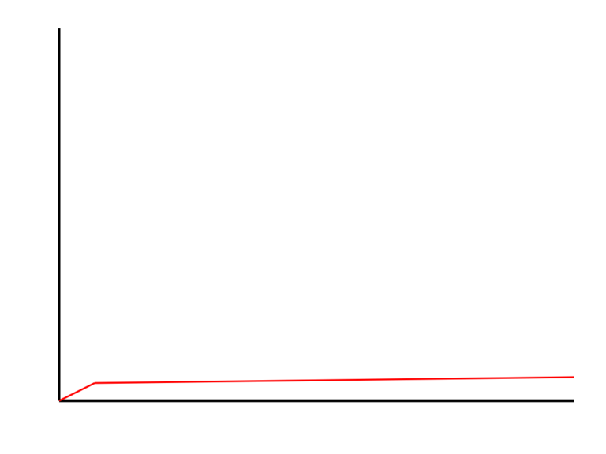
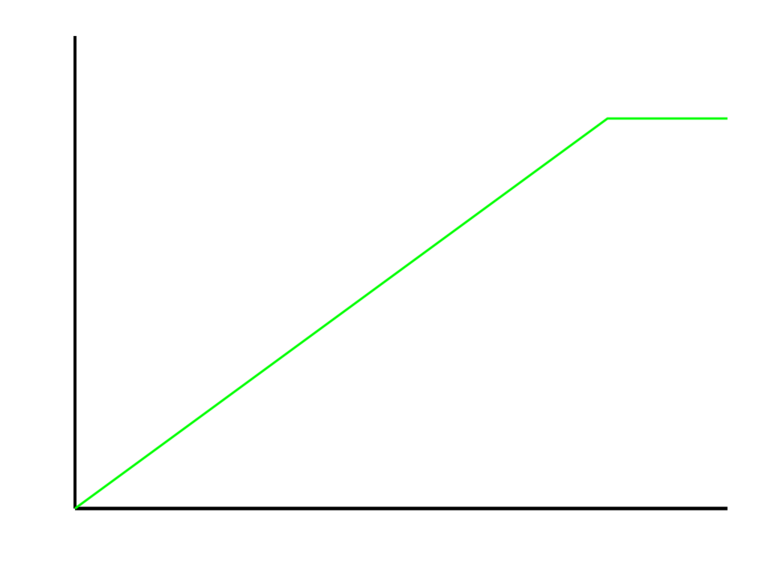
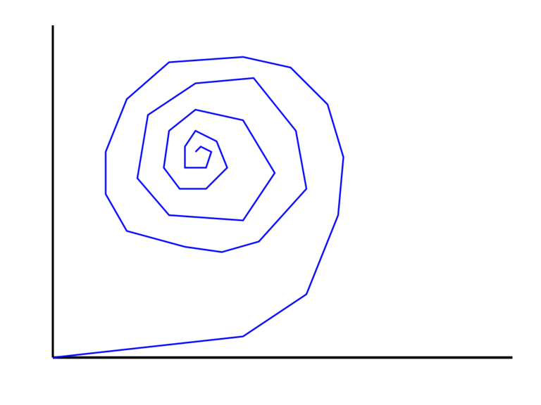
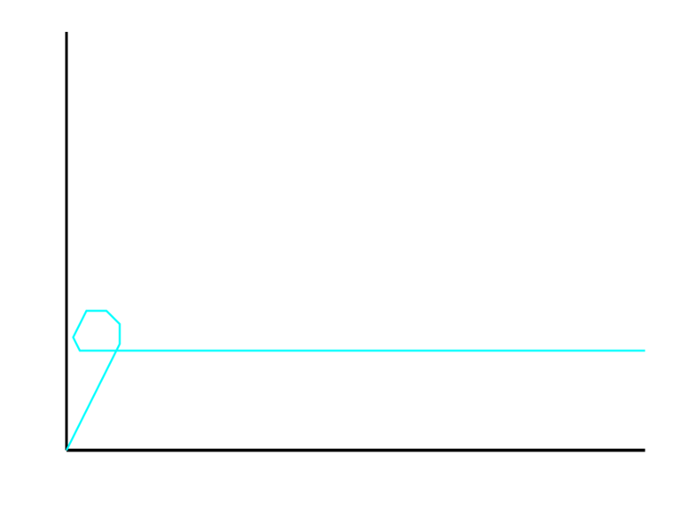

author: Derek Carter aka "goozbach"  
company: Goozbach Infrastructure Solutions  
title: Acme
subtitle: A User Interface for Programmers
footer: Derek Carter
subfooter: http://presentation.goozbach.com/

# What is Acme?

* A User Interface

  * Notice: I did not say \"Editor\"

  * Notice: I did not say \"IDE\"

  * \"User Interface?\" \-\- Yeah, I\'ll get to that.

# History Lesson

* Acme is the Editor/Shell for [Plan9 from Bell Labs](http://plan9.bell-labs.com/plan9/).
  The successor to Unix. 

* \"Plan9?\"

  > \"Unicibis Ipsis Unicor\"

  * More Unixy than Unix

# Plan9 Philosophy

* Kinda complex but it boils down to:

  > \"How do we build UNIX with what we learned from UNIX on harware of the \'90s?\"

# Acme User Interface

* Word of warning: **Burning Synapses Follow**

* Editor learning curves

# Nano Learning Curve

# Vim Learning Curve

# Emacs Learning Curve

# Acme Learning Curve

# Installing Acme

* Use Plan9

* Install using [Plan9Port](http://swtch.com/plan9port/)

* [Acme SAC](https://www.google.com/url?sa=t&rct=j&q=&esrc=s&source=web&cd=1&cad=rja&ved=0CDEQFjAA&url=http%3A%2F%2Fcode.google.com%2Fp%2Facme-sac%2F&ei=To-0UZn-H8qp0AG1uIDADg&usg=AFQjCNHpENww_5MSMugeXPG4iDJbmOyXgA&sig2=qaZcEy-7sC4oOzkDQHQkSg&bvm=bv.47534661,d.dmQ)

# Acme\'s Paradigm

* Everything is text/files

* Let\'s take a look at Acme itself

!SLIDE

&lt;!\-\- Demo Goes Here \-\-&gt;

# Using Acme

* You\'re gonna want a three button mouse

# Pipes

* Help
