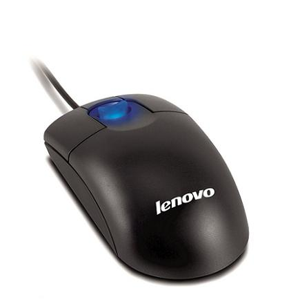

author: Derek Carter aka "goozbach"  
company: Goozbach Infrastructure Solutions  
title: Acme
subtitle: A User Interface for Programmers
footer: Derek Carter
subfooter: http://presentation.goozbach.com/

# What is Acme?

* A User Interface

  * Notice: I did not say \"Editor\"

  * Notice: I did not say \"IDE\"

  * \"User Interface?\" \-\- Yeah, I\'ll get to that.

# History Lesson

* Acme is the Editor/Shell for [Plan9 from Bell Labs](http://plan9.bell-labs.com/plan9/).
  The successor to Unix. 

* \"Plan9?\"

  > \"Unicibis Ipsis Unicor\"

  * More Unixy than Unix

# Plan9 Philosophy

* Kinda complex but it boils down to:

  > \"How do we build UNIX with what we learned from UNIX on harware of the \'90s?\"

# Acme User Interface

* Word of warning: **Burning Synapses Follow**

* Editor learning curves

# Nano Learning Curve

# Vim Learning Curve

# Emacs Learning Curve

# Acme Learning Curve

# Installing Acme

* Use Plan9

* Install using [Plan9Port](http://swtch.com/plan9port/)

* [Acme SAC](https://www.google.com/url?sa=t&rct=j&q=&esrc=s&source=web&cd=1&cad=rja&ved=0CDEQFjAA&url=http%3A%2F%2Fcode.google.com%2Fp%2Facme-sac%2F&ei=To-0UZn-H8qp0AG1uIDADg&usg=AFQjCNHpENww_5MSMugeXPG4iDJbmOyXgA&sig2=qaZcEy-7sC4oOzkDQHQkSg&bvm=bv.47534661,d.dmQ)

# Acme\'s Paradigm

* Everything is text/files

* Let\'s take a look at Acme itself

!SLIDE

&lt;!\-\- Demo Goes Here \-\-&gt;

# Using Acme

* You\'re gonna want a three button mouse

# Button clicks

* Button 1 (left button)

  * Place cursor

* Button 2 (middle button)

  * Execute text (or command)

* Button 3 (right button)

  * Umm\.\.\. it depends (mostly plumb)

# Mouse Chords

* Cut(Copy) and Paste

  1. Drag B1 (select text, don\'t let go)

  1. Click B2 (don\'t let go of B1, this will cut)

  1. Click B3 (let both go, this will paste back into place)

  1. Click B1+B3 (paste again)

# Advanced Mouse Chords

* Honestly I don\'t quite understand them myself.

* But

  * There\'s one for execute

  * Another for \'plumb\'

  * You can also plumb or execute with a double chord to specify arguments to a command

# Plumbing

* Crazy Voodoo

* Think intelligent Unix pipes.

# Win

* Running a shell in a buffer

* I have modified my dotfiles to make it nicer

  * (I still need to get these into github, sorry)

# Programmer\'s Interface

* Plan9 paridigm

  * We can manupliate Acme by using file manipulation commands

  * Easily done with 9p

  * Can also be done by mounting Acme namespace using FUSE.

# Acme-Tools

* [Small programs](https://github.com/goozbach/acme-tools) I\'ve written to use with Acme
